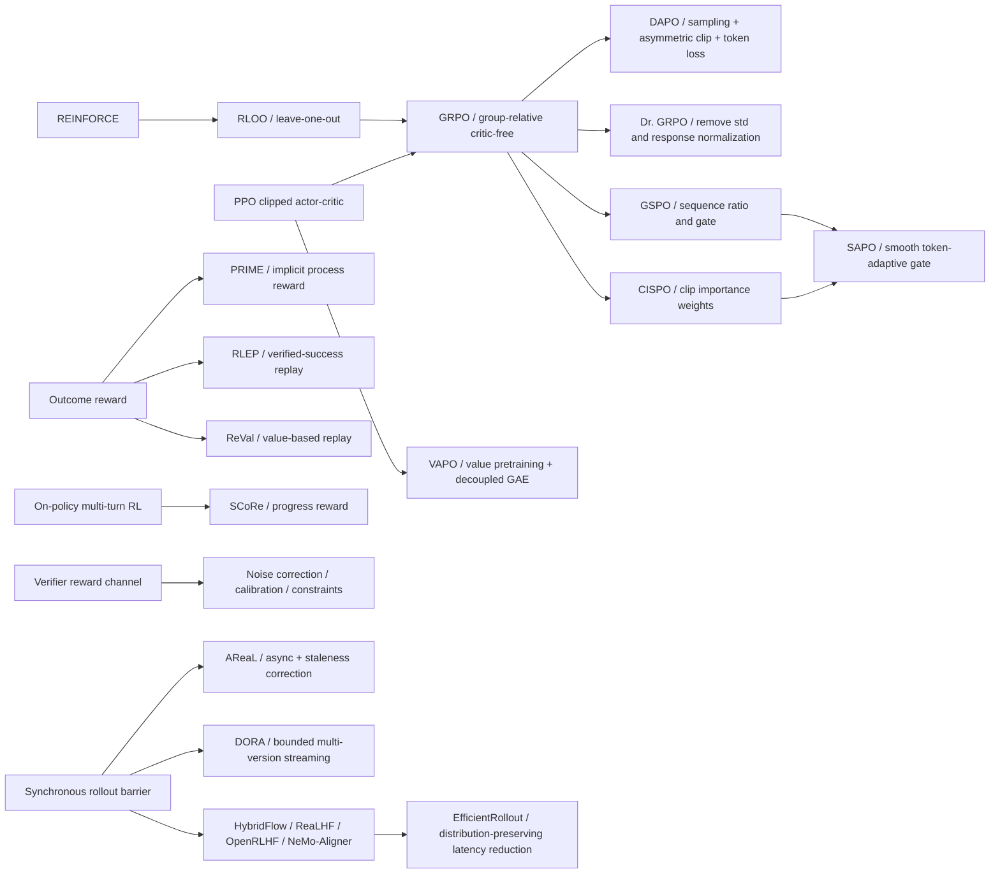

# 方法谱系图

## 谱系

## 边的解释

| 分支 | 真正改变的对象 | 不应误判为 |
|---|---|---|
| RLOO → GRPO | baseline 从 leave-one-out 均值变为含标准化的组相对优势，并叠加 PPO 风格 surrogate | 完全独立的策略梯度家族 |
| GRPO → Dr. GRPO | advantage 标准化与长度聚合 | 新奖励函数 |
| GRPO → DAPO | 裁剪区间、组采样、loss 聚合和超长塑形 | 单一机制的干净因果验证 |
| GRPO → GSPO/CISPO/SAPO | importance ratio 的粒度和门函数 | 新信用分配机制 |
| PPO → VAPO | critic 初始化、GAE 和长序列训练配方 | critic-free 方法 |
| Outcome → PRIME | reward granularity 从终局扩展到隐式过程信号 | 已验证的真实过程因果标签 |
| On-policy → replay | 数据年龄和复用方式 | 免费增加有效样本；仍要承担 staleness/选择偏差 |
| 同步 → 异步系统 | rollout/update 调度和系统执行路径 | 优化器本身的新颖性 |

## 直接竞争关系

- `GRPO/RLOO` 与 `VAPO`：critic-free 低成本基线对 learned critic 密集信用。
- `token clip`、`sequence gate`、`soft token gate`：同一 trust-weighting 问题的不同粒度和连续性选择。
- `fresh on-policy`、`verified-success replay`、`value-based replay`：稳定性、探索和样本复用三方权衡。
- `maximize proxy reward` 与 `calibration/constraint/uncertainty penalty`：性能上限与 reward hacking 风险权衡。
- `synchronous barrier` 与 `bounded asynchronous rollout`：严格新鲜度与吞吐效率权衡。
