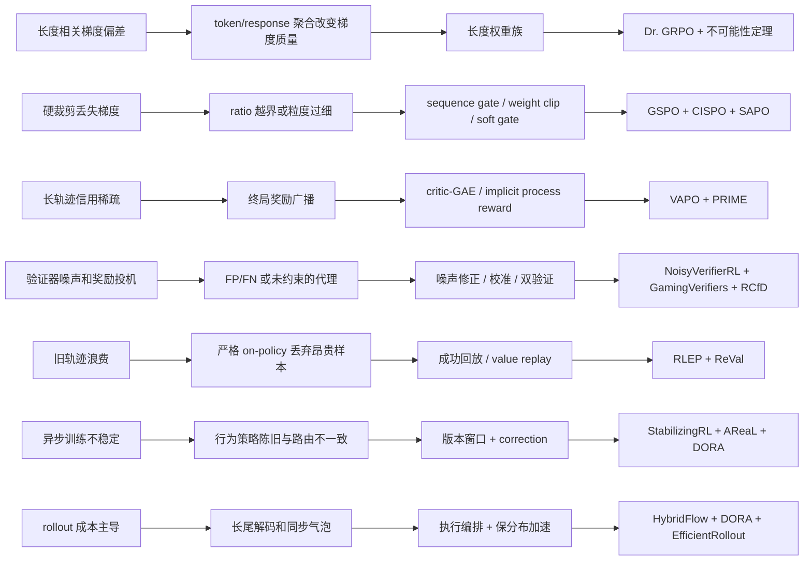

# 问题—机制—证据图

## 证据表

| 失败模式 | 原因假设 | 已有机制 | 强证据 | 弱或冲突证据 | 真正未解决区域 |
|---|---|---|---|---|---|
| 长度偏差 | loss 聚合让不同长度获得不同总梯度质量 | response/token 聚合、长度权重族 | 不可能性定理证明 outcome-reward 条件下无偏与长度不变不可兼得 | DAPO/Dr. GRPO 改动与其他配方耦合 | 稠密过程奖励能否绕开边界；任务条件长度效用 |
| group 统计不稳 | 小组、全同奖励和标准差归一化改变方差与任务权重 | LOO、均值中心化、动态采样、组大小设计 | U-statistic 提供有限样本解释 | DAPO 过滤组会改变问题分布 | 非独立解码和非平稳奖励下的组大小规律 |
| 硬裁剪梯度损失 | 越界 token 或序列被门控为零 | token weight clipping、sequence gate、soft gate | 多篇受控算法比较一致指出硬门问题 | 跨模型独立复现和长期真实目标改进不足 | 在固定计算与有效步长下选择门粒度/形状 |
| 长轨迹稀疏信用 | outcome reward 广播无法区分关键步骤 | value+GAE、隐式过程奖励、多轮 progress reward | VAPO/PRIME/SCoRe 均有任务实验 | critic bias 与隐式 reward 自我强化尚未同台比较 | 用低成本前缀扰动区分“真过程信用”与“似然代理” |
| verifier 噪声 | 二值检查产生非对称 FP/FN | backward/forward correction、appeal、混合验证 | NoisyVerifierRL 直接建模并干预；GamingVerifiers 给出因果 shortcut 证据 | VerIF/RISE 的性能提升不等于抗自适应 hacking | 实例依赖、会随策略变化的噪声率 |
| reward overoptimization | policy 离开奖励模型训练支持 | demonstration calibration、constraints、uncertainty penalty | 受控 gold/proxy 曲线和约束实验 | 不同论文使用不同 proxy 与任务 | 从 learned RM 迁移到 rule/LLM verifier 的统一干预 |
| 旧轨迹浪费 | 严格 fresh rollout 牺牲样本效率 | 成功轨迹回放、value-based replay | RLEP/ReVal 报告更快收敛 | 选择偏差、bootstrap bias、模型规模证据有限 | 安全复用年龄与 replay ratio 的可迁移边界 |
| staleness | behavior/target policy 与 MoE 路由不一致 | importance correction、routing replay、版本窗口 | StabilizingRL 机制分析；DORA 难度匹配后支持小窗口安全 | 安全窗口依赖学习速度、模型和系统 | 以 policy divergence 而非 step count 自适应设窗 |
| 延迟/吞吐混淆 | tokens/s 掩盖长尾请求和同步等待 | 调度、参数重分配、multi-version streaming、self-speculative decode | EfficientRollout 同时报 rollout/end-to-end latency；DORA/AReaL 报告墙钟加速 | 多数框架只报告吞吐或硬件特定 speedup | 统一 p50/p95、tokens/s、端到端时间和最终质量协议 |

## 因果解释中的禁止跳步

- 训练更快不等于优化器更好；系统论文只能支持成本或调度结论。
- benchmark 分数提高不等于机制解释成立；多组件 recipe 必须降级为相关性证据。
- verifier 通过率提高不等于真实正确性提高；必须有独立检查或扰动测试。
- replay 更快收敛不等于无偏；必须同时报告策略距离、有效样本量和探索覆盖。
